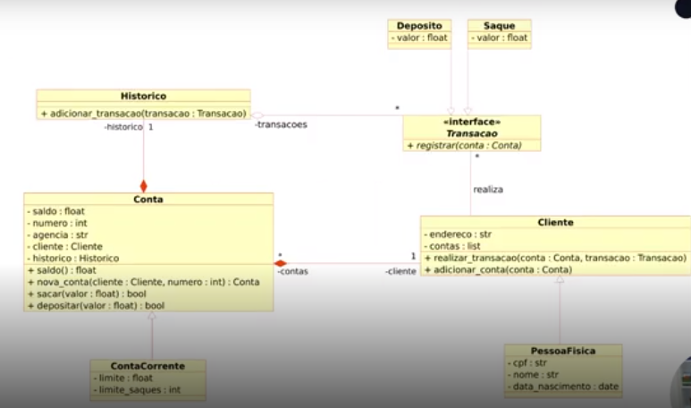

> ## Projeto feito por Rafaella Abreu durante o Python AI Backend Developer da DIO

## **Desafio Sistema Bancário**

### Descrição do projeto:

Fomos contratados por um grande banco para desenvolver o seu novo sistema. 
Esse banco deseja modernizar suas operações e para isso escolheu a linguagem Python. 

#### Funcionalidades 1:

##### Objetivo Geral:

Para a primeira versão do sistema devemos implementar apenas 3 operações: depósito, saque e extrato.

* **Operação de depósito:**

Deve ser possível depositar valores positivos para a minha conta bancária. 
A v1 do projeto trabalha apenas com 1 usuário, dessa forma não precisamos nos preocupar em identificar qual é o número da agência e conta bancária. 
Todos os depósitos devem ser armazenados em uma variável e exibidos na operação de extrato.

* **Operação de saque:**

O sistema deve permitir realizar 3 saques diários com limite máximo de R$ 500,00 por saque. 
Caso o usuário não tenha saldo em conta, o sistema deve exibir uma mensagem informando que não será possível sacar o dinheiro por falta de saldo.
Todos os saques devem ser armazenados em uma variável e exibidos na operação de extrato.

* **Operação de extrato:**

Essa operação deve listar todos os depósitos e saques realizados na conta.
No fim da listagem deve ser exibido o saldo atual da conta.
Os valores devem ser exibidos utilizando o formato R$ XXX.XX, exemplo: 1500.45 = R$ 1500.45

#### Funcionalidades 2:

##### Objetivo Geral:

Aprimorar a estrutura e a eficiência do sistema, implementando as operações existentes de saque, depósito e extrato separando-as em funções. Criar duas novas funções: cadastrar usuário(cliente) e cadastrar conta bancária.

* **Funçao sacar**

Deve receber os argumentos apenas por nome (keyword only).
Sugestão de argumentos: saldo, valor, extrato, limite, numero_saques, limite_saques.
Sugestão de retorno: saldo e extrato.

* **Funçao depositar**

Deve receber os argumentos apenas por posição (positional only).
Sugestão de argumentos: saldo, valor, extrato.
Sugestão de retorno: saldo e extrato.

* **Funçao visualizar extrato**

Deve receber os argumentos por posição e nome (positional only e keyword only).
Argumentos posicionais: saldo.
Argumentos nomeados: extrato.

* **Funçao criar usuário (cliente do banco)**

Deve armazenar os usuários em uma lista, um usuário é composto por: nome, data de nascimento, cpf e endereço.
O endereço é uma string com formato: logradouro, nro - bairro - cidade/estado.
Deve ser armazenado somente os números do CPF.
Não podemos cadastrar 2 usuários com o mesmo CPF.

* **Funçao criar conta corrente (vincular com usuário)**

Deve armazenar contas em uma lista, uma conta é composta por: agência, número da conta e usuário. O número da conta é sequencial, iniciando em 1. 
O número da agência é fixo: "001".
O usuário pode ter mais de uma conta, mas uma conta pertence a somente um usuário.

💡 Para vincular um usuário a uma conta, filtre a lista de usuários buscando o número do CPF informando para cada usuário da lista.

* **Funçao listar contas**

* **Funçao listar usuários**

#### Funcionalidades 3:

##### Objetivo Geral:

Iniciar a modelagem do sistema bancário em POO. Adicionar classes para cliente e as operações bancárias: depósito e saque.

Atualizar a implementação do sistema bancário, para armazenar os dados de clientes e contas bancárias em objetos ao invés de dicionários. O código deve seguir o modelo de classes UML a seguir:

**Extra**

Após concluir a modelagem das classes e a criação dos métodos. Atualizar os métodos que tratam as opções do menu, para funcionarem com as classes modeladas.